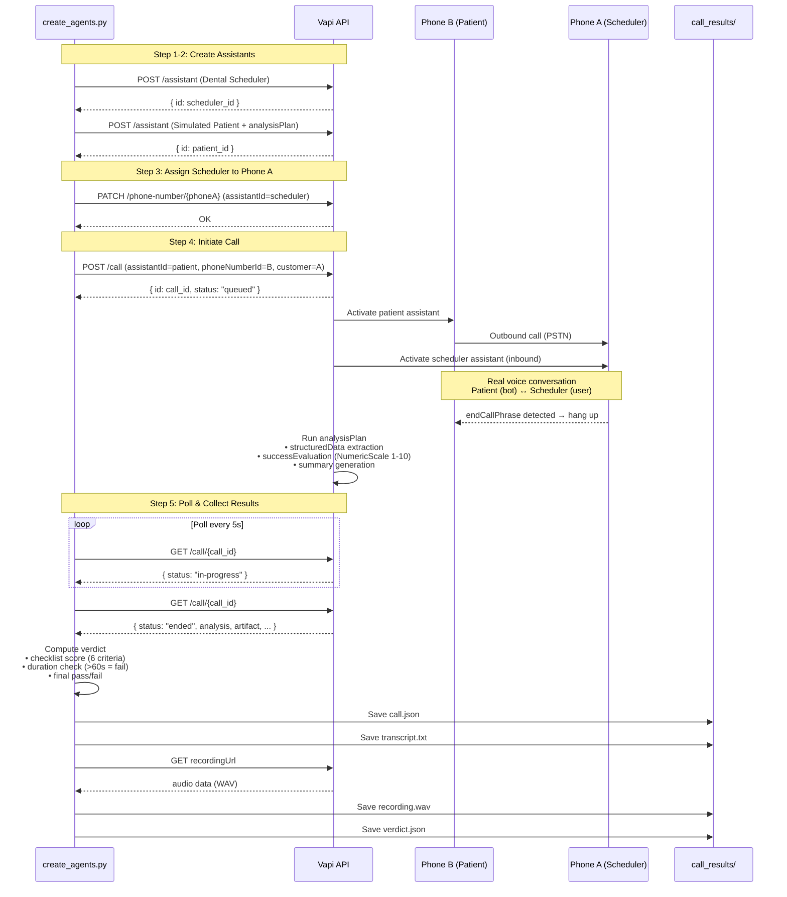
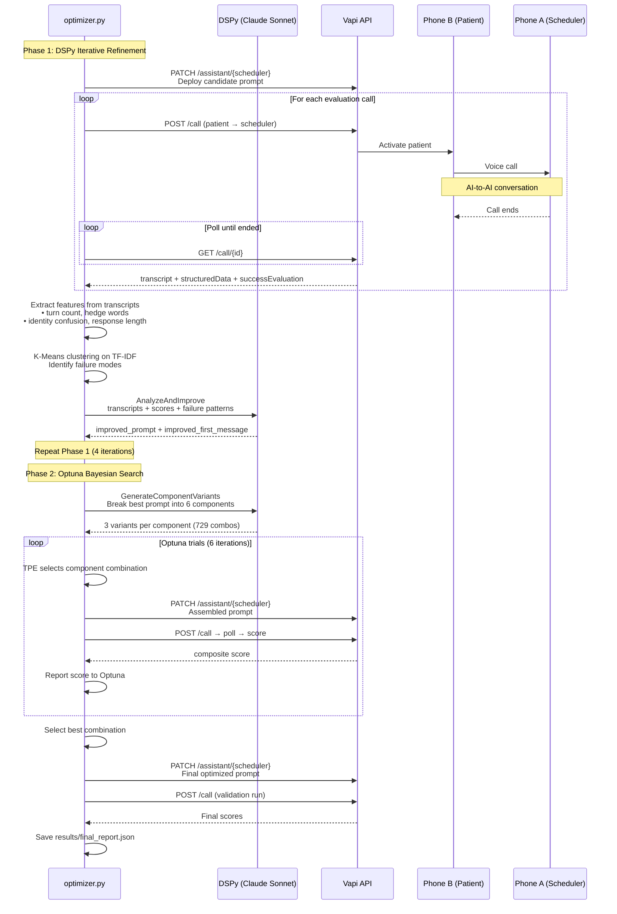
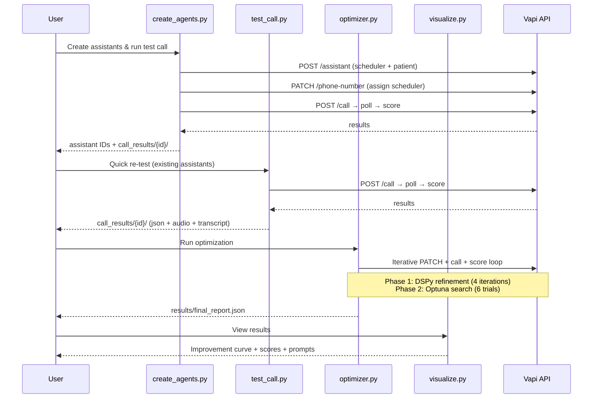

# Vapi Voice Agent Optimizer

ML-driven system that automatically improves a Vapi voice agent through iterative evaluation and prompt optimization.

## What is this

Vapi is a developer platform for building voice agents using STT, LLMs, and TTS. It abstracts away the complexity of coordinating these subsystems through a web platform and APIs, while giving developers full control over provider selection and configuration.

But this raises a fundamental challenge in the LLM era: how do you systematically optimize your agent's prompts? Manual prompt tweaking is brittle, tedious, and empirically driven — a human changes words until they "think" it's good enough, deploys, observes, and repeats. It's rarely data-driven.

This repository automates that process. It introduces a framework that creates baseline agents, evaluates them via real phone calls between an instructed bot and an agent by using structured scoring, applies DSPy-driven prompt optimization and Bayesian search (Optuna TPE) over prompt configurations, and iterates until convergence — replacing human intuition with quantitative feedback loops.

## How It Works

### 0. tl;dr

1. Call recording prior to optimization

https://github.com/user-attachments/assets/dadfe9b1-e965-4ce0-a437-e8007bfda7c0

2. Call recording after optimization


https://github.com/user-attachments/assets/4af2f8e7-1ec7-4384-843b-ee337a0def0f


### 1. Agent Creation & Baseline Evaluation — `create_agents.py`

Creates two Vapi assistants: a dental office scheduler (gpt-4o-mini) with a minimal, unoptimized prompt, and a simulated patient caller (gpt-4o) with a challenging persona that pushes back on vague pricing, asks about tooth pain, and demands cancellation policy details. The scheduler is assigned to an inbound phone number, the patient calls it, and the resulting call is scored via Vapi's built-in analysis plan — establishing the baseline performance that the optimizer will improve upon.

### 2. Optimization Loop — `optimizer.py`

#### 2.1 DSPy Iterative Refinement

Runs 4 iterations of prompt improvement. Each iteration deploys the current prompt to the scheduler, triggers a test call, and collects Vapi's structured evaluation (6-boolean checklist + NumericScale 1-10). A scikit-learn feature extractor analyzes the transcript for quantitative failure signals — hedge word frequency, identity confusion, missing pricing, and booking confirmation gaps. These patterns are fed into a DSPy `Chain Of Thought` module (powered by Claude Sonnet) that analyzes the failures and generates an improved prompt. The loop repeats until the checklist score reaches 95% or all iterations are exhausted.

#### 2.2 Bayesian Prompt Search (Optuna TPE)

Decomposes the best prompt from Phase 1 into 6 modular components: identity, services & pricing, hours & availability, booking flow, objection handling, and rules & guardrails. DSPy generates 3 stylistic variants per component (concise, detailed, warm), creating a search space of 3⁶ = 729 possible prompt configurations. Optuna's Tree-structured Parzen Estimator explores this space efficiently in 6 trials, using a probabilistic surrogate model to select promising combinations without exhaustive search. Each trial assembles a prompt, deploys it, runs a real call, and reports the composite score back to the optimizer.

#### 3. Final Validation — `optimizer.py` + `test_call.py`

The optimizer deploys the highest-scoring prompt and runs a final validation call to confirm performance. Additionally, test_call.py can be used for manual re-testing at any time — it triggers a call using the existing assistants and prints the full scorecard.

## Steps to reproduce

### Prerequisites

- Python 3.10+
- Vapi account with 2 phone numbers (A twillio number might be required since the iterative process can exhaust outbound calls)
- Anthropic API key (for DSPy optimizer)

#### Environment Variables

These variables are required to be changed in the .env file

```bash
export ANTHROPIC_API_KEY="your-anthropic-key"

# get these from Vapi's panel
export VAPI_API_KEY="your-vapi-key"
export VAPI_PHONE_A_NUMBER=""  # scheduler's inbound number.
export VAPI_PHONE_B_ID=""  # patient's phone ID

# From create_agents.py output (run it once first)
export SCHEDULER_ASSISTANT_ID=""
export PATIENT_ASSISTANT_ID=""
```

#### Step by step execution

#### 1. Run `uv run create_agents.py` which will:

- Create the dental scheduler assistant (gpt-4o-mini + low quality prompt)
- Create the simulated patient assistant (gpt-4o + hard persona + analysisPlan)
- Assign the scheduler to Phone A
- Make one test call (patient → scheduler)
- Print results + assistant IDs
- After it finishes, grab the two assistant IDs from the output and add them to your .env

That will print a summary of the call where you can note the transcription and the Structured Data output by the Analysis Plan. A very simple and vague instruction prompt is provided to the agent. That's what we want to optimize. All the logs from the call are stored inside the folder `call_results`, including its recording.

```
────────────────────────────────────────
TRANSCRIPT
────────────────────────────────────────
User: Hello. How can I help you today?
AI: Hi. Um, I wanted to schedule a teeth cleaning. If possible.
User: I can help you with that. However, I don't have the ability to schedule appointments directly. I recommend calling your dental office or visiting their website to book your teeth cleaning If you need help finding a dental office or have any other questions, let me know.
AI: Oh, okay. Sorry. I thought this was the dental office. I'll try calling back. Thanks.
User: No problem at all. If you need any help preparing for your appointment, or have questions about dental care, feel free to ask. Have a great day.


────────────────────────────────────────
ANALYSIS
────────────────────────────────────────

Summary: The AI attempted to schedule a teeth cleaning appointment, mistakenly believing they had reached their dental office. The User clarified that they could not directly schedule appointments and advised the AI to contact their dental office or visit their website. The AI then realized their error and ended the call to contact the correct office.

Structured Data:
{
  "serviceRequested": "a teeth cleaning",
  "appointmentBooked": false,
  "schedulerOfferedTimes": false,
  "schedulerCollectedName": false,
  "schedulerGreetedProperly": true,
  "schedulerProvidedPricing": false,
  "schedulerConfirmedAppointment": false
}

Success Evaluation: 1
Vapi Score: 1/10 | Duration: 42.0s
```

Update `SCHEDULER_ASSISTANT_ID` and `PATIENT_ASSISTANT_ID` in the `.env` with the ids output by this step.

#### 2. Now run `uv run optimizer.py.`

This can take ~30-40 minutes, ~10-11 calls, and cost ~$2-3 usd.

- Phase 1 — DSPy Iterative Refinement (4 iterations)
  - Deploy bad prompt to scheduler via PATCH /assistant
  - Run test call (patient → scheduler)
  - Score call using Vapi's structured data + NumericScale
  - Extract transcript features (hedges, confusion, pricing mentions) via scikit-learn
  - Feed transcripts + scores + failure patterns to DSPy (Claude Sonnet)
  - DSPy generates improved prompt
  - Repeat 4 times or until checklist hits 95%

- Phase 2 — Bayesian Search (6 trials)
  - DSPy generates 3 variants for each of 6 prompt components (18 variants total)
  - Optuna TPE picks a combination of variants
  - Deploy assembled prompt, run call, score it
  - Report score back to Optuna
  - Repeat 6 times, Optuna learns which combos work

- Final step
  - Deploy best prompt found across both phases
  - Run one validation call
  - Save report to results/final_report.json

After this you'll have an optimized prompt automatically deployed to the agent's configuration and the results of the final evaluation saved to `results/final_report.json`.

#### 3. Final test

Run `uv run test_call.py` to verify the optimized agent with a fresh call. This uses the existing assistants (no creation) and prints the full scorecard — checklist, Vapi score, booking status, and duration. Results are saved to `call_results/`. Compare it to the first call.

## Architecture

### Two-Assistant Test Framework

Three different models, three different jobs:

- **gpt-4o-mini** — the scheduler being optimized (cheap, weak. we want to extract the most of it)
- **gpt-4o** — the simulated patient (strong, fixed, challenging tester)
- **Claude Sonnet** — the optimizer brain (DSPy analysis, prompt generation, variant creation)

The bot patient calls the scheduler via Vapi's telephony. Real voice calls are made, transcribed, and scored automatically.

### Machine Learning concept
This approach is analogous to contextual bandit optimization, where each prompt variant is an arm and rewards are estimated through interaction with the environment.

### Scoring Pipeline

After each call, Vapi's `analysisPlan` extracts:

- `structuredData`: Boolean checklist of scheduler behaviors
- `successEvaluation`: 1-10 NumericScale score from LLM judge

The optimizer combines these with call duration and booking status into a single composite metric that DSPy optimizes against.

## Results

Starting from a minimal prompt (`"You are a receptionist at a dental office. Help people who call."`), the optimizer autonomously discovers that the prompt needs clinic identity, exact pricing, available hours, a booking flow, objection handling, and a confirmation protocol.

### Improvement Curve

#### Phase 1 — DSPy Iterative Refinement

| Iteration | Composite | Checklist | Booked | Vapi Score | Duration |
|---|---|---|---|---|---|
| 1 (baseline) | - | 1/6 | ❌ | 1 | 42s (timeout) |
| 2 | 0.493 | 4/6 | ❌ | 8 | 180s (timeout) |
| 3| 0.597 | 5/6 | ❌ | 9 | 180s (timeout) |
| **4** | **0.986** | **6/6** | **✅** | **10** | **99s** ★ |

#### Phase 2 — Optuna Bayesian Search

| Trial | Composite | Checklist | Booked | Component Selection |
|---|---|---|---|---|
| 0 | 0.410 | 3/6 | ❌ | identity=1, pricing=0, hours=1, flow=2, objections=0, rules=2 |
| 1 | 0.410 | 3/6 | ❌ | identity=2, pricing=2, hours=1, flow=1, objections=0, rules=1 |
| **2** | **0.850** | **6/6** | **✅** | **identity=2, pricing=2, hours=1, flow=0, objections=2, rules=1** |
| 3 | 0.513 | 4/6 | ❌ | identity=1, pricing=2, hours=2, flow=2, objections=1, rules=0 |
| 4 | 0.747 | 5/6 | ✅ | identity=1, pricing=1, hours=2, flow=0, objections=2, rules=1 |
| 5 | 0.430 | 3/6 | ❌ | identity=2, pricing=1, hours=0, flow=2, objections=2, rules=2 |

Final Validation: 0.830 6/6 checklist, BOOKED ✓

### Summary

| Metric             | Before                | After               |
| ------------------ | --------------------- | ------------------- |
| Composite Score    | 0.493                 | **0.986**           |
| Checklist          | 1/6                   | **6/6**             |
| NumericScale       | 1                     | **10**              |
| Appointment Booked | ❌                    | **✅**              |
| Call Duration      | 42s (patient gave up) | **99s (completed)** |
| Improvement        | —                     | **+100%**           |
| Total cost         | —                     | **$2.05 (9 calls)** |

## Tradeoffs & Limitations

- **Single call per evaluation.** Each iteration runs one test call to save budget (~$0.24/call). This introduces variance — a single unlucky call can misrepresent a prompt's quality. A production system would run 3-5 calls per evaluation and average the scores, at the cost of longer runtime and higher spend.

- **Fixed test persona.** The simulated patient always plays the same character (Maria Garcia, anxious about pricing, tooth pain, cancellation policy). This means the optimizer can overfit to this specific scenario. A more robust system would rotate through multiple patient personas with different personalities, requests, and objection styles.

- **Limited Optuna budget.** Phase 2 explores only 6 trials out of 729 possible prompt configurations. TPE makes this efficient, but more trials would yield better coverage of the search space. The tradeoff is deliberate — each trial costs a real phone call, and the assignment is scoped for ~$2-3 total spend.

- **Composite metric weights** are hand-tuned. The scoring formula (checklist 50%, NumericScale 20%, duration 15%, booking 15%) reflects my judgment about what matters for a dental scheduler. These weights could themselves be optimized, but that adds a meta-optimization layer that's out of scope.

- **Prompt-only optimization.** The system only optimizes the system prompt and first message. It doesn't touch model parameters (temperature, max tokens), voice settings, or transcriber configuration. These could be added as additional Optuna dimensions, but prompt quality is the highest-leverage lever for this use case.

- **Evaluation relies on Vapi's analysis plan.** The structured data extraction and NumericScale scoring are performed by Vapi's built-in LLM judge. This introduces its own biases — for example, the NumericScale often gave 7-9 to calls where the appointment was never booked. The boolean checklist proved more reliable than the subjective score, which is why it carries 50% of the composite weight.

## Sequence Diagrams

### Create Agents & Test Call (`create_agents.py`)



### Optimization Loop (`optimizer.py`)



### Full System Overview


