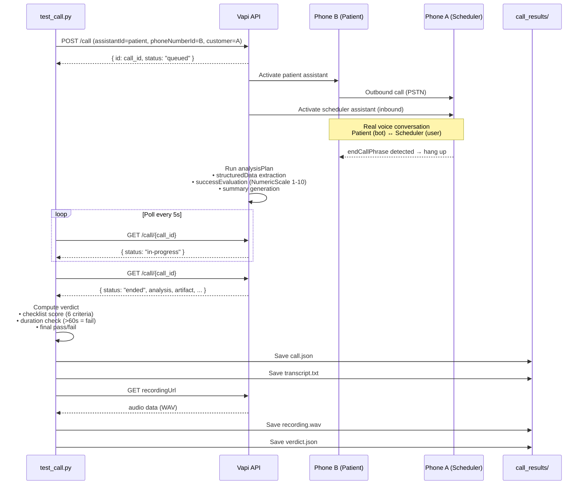
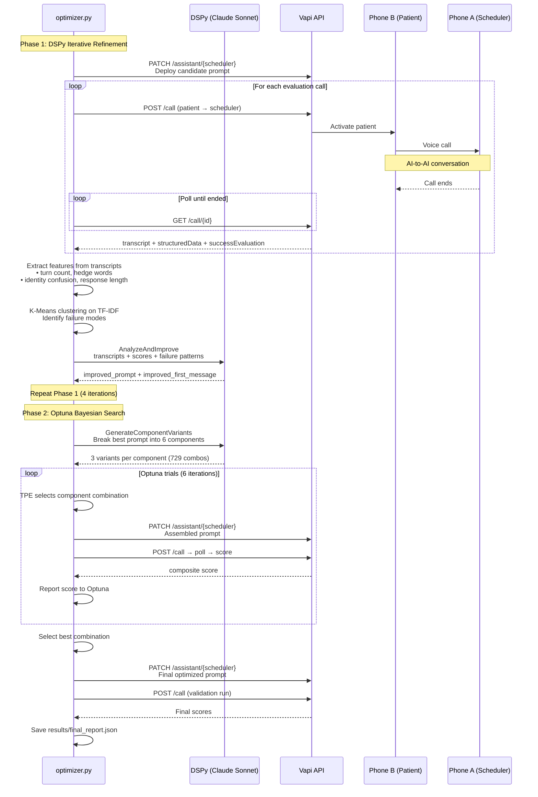
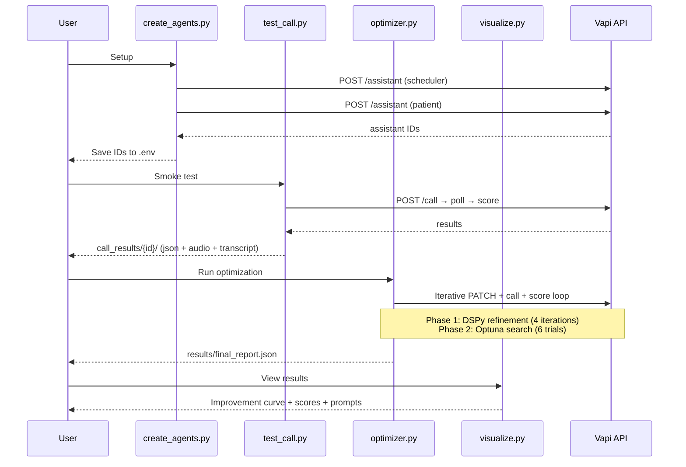

# Vapi Voice Agent Optimizer

ML-driven system that automatically improves a Vapi voice agent through iterative evaluation and prompt optimization.

## How It Works

```
┌─────────────────────────────────────────────────────────┐
│                   Optimization Loop                      │
│                                                          │
│  1. Deploy candidate prompt → PATCH /assistant           │
│  2. Run test calls → POST /call (patient calls scheduler)│
│  3. Score calls → GET /call/{id} (structured data + eval)│
│  4. Analyze failures → DSPy (LLM-driven analysis)       │
│  5. Generate improved prompt → DSPy + Bayesian search    │
│  6. Repeat until convergence                             │
└─────────────────────────────────────────────────────────┘
```

### ML Components

1. **DSPy Prompt Optimization** — Uses `ChainOfThought` to analyze failing transcripts and generate improved prompts. Two-stage pipeline: failure analysis → prompt generation.

2. **Transcript Feature Extraction** — Extracts numerical features (turn count, hedge words, identity confusion, response length) from each call transcript.

3. **Failure Clustering** — K-Means clustering on TF-IDF vectors of scheduler responses to identify distinct failure modes (e.g., "pricing loop", "identity confusion", "never confirms").

4. **Composite Scoring** — Weighted metric combining:
   - Checklist score (50%): 6 boolean criteria from Vapi structured data
   - Vapi NumericScale (20%): 1-10 LLM judge score
   - Duration bonus (15%): Penalty for calls over 90 seconds
   - Booking bonus (15%): Whether appointment was actually booked

### Evaluation Criteria (Checklist)

| Criterion                       | What It Measures                        |
| ------------------------------- | --------------------------------------- |
| `schedulerGreetedProperly`      | Identified clinic by name in greeting   |
| `schedulerCollectedName`        | Asked for and recorded patient's name   |
| `schedulerOfferedTimes`         | Proactively offered available hours     |
| `schedulerProvidedPricing`      | Gave specific (not vague) pricing       |
| `schedulerConfirmedAppointment` | Confirmed booking details before ending |
| `appointmentBooked`             | Actually completed the booking          |

## Setup

### Prerequisites

- Python 3.10+
- Vapi account with 2 phone numbers and 2 assistants configured
- Anthropic API key (for DSPy optimizer)
- OpenAI API key (used by Vapi for the scheduler model)

### Environment Variables

```bash
export VAPI_API_KEY="your-vapi-key"
export ANTHROPIC_API_KEY="your-anthropic-key"

# Shared with test_call.py (you already have these)
export VAPI_PHONE_A_NUMBER="+16282441616"           # scheduler's inbound number
export VAPI_PHONE_B_ID=""  # patient's phone ID

# From test_call.py output (run it once first)
export SCHEDULER_ASSISTANT_ID="your-scheduler-assistant-id"
export PATIENT_ASSISTANT_ID="your-patient-assistant-id"
```

### Install & Run

```bash
pip install -r requirements.txt
python optimizer.py
```

### View Results

```bash
python visualize.py
```

## Sequence Diagram

### Single Test Call (`test_call.py`)



### Optimization Loop (`optimizer.py`)



### Full System Overview



## Architecture

### Two-Assistant Test Framework

Three different models, three different jobs:

- **gpt-4o-mini** — the scheduler being optimized (cheap, weak — the whole point)
- **gpt-4o** — the simulated patient (strong, fixed, challenging tester)
- **Claude Sonnet** — the optimizer brain (DSPy analysis, prompt generation, variant creation)

The patient calls the scheduler via Vapi's telephony. Real voice calls are made, transcribed, and scored automatically.

### Scoring Pipeline

After each call, Vapi's `analysisPlan` extracts:

- `structuredData`: Boolean checklist of scheduler behaviors
- `successEvaluation`: 1-10 NumericScale score from LLM judge

The optimizer combines these with call duration and booking status into a single composite metric that DSPy optimizes against.

## Results

Starting from a minimal prompt ("You are a receptionist at a dental office. Help people who call."), the optimizer discovers that the prompt needs:

- Clinic identity (name in greeting)
- Specific service prices (not ranges)
- Available hours
- Structured booking flow
- Objection handling instructions
- Cancellation policy

| Metric             | Before         | After |
| ------------------ | -------------- | ----- |
| Checklist          | 0-2/6          | 6/6   |
| NumericScale       | 1-7            | 10    |
| Appointment Booked | ❌             | ✅    |
| Call Duration      | 3min (timeout) | ~70s  |
| Cost per call      | $0.24          | $0.09 |
